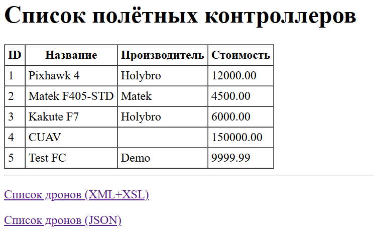
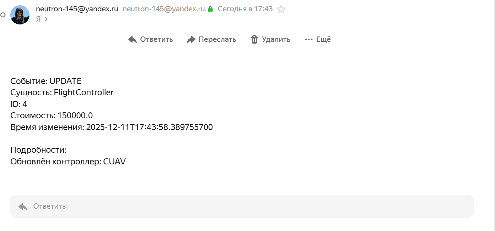

# Лабораторная работа №4
Выполнил: Абельдинов Рафаэль  
Группа: 6132-010402D  


## Задание 1  
В базу данных была добавлена новая таблица через интерфейс pgAdmin4:
```
CREATE TABLE change_log (
    id           BIGSERIAL PRIMARY KEY,
    entity_name  VARCHAR(100) NOT NULL,        
    entity_id    BIGINT       NOT NULL,
    operation    VARCHAR(20)  NOT NULL,        
    change_time  TIMESTAMP    NOT NULL DEFAULT NOW(),
    details      TEXT                         
);
```
`entity_name` - название класса, который был изменен.  
`entity_id` - ID объекта в таблице, который был изменен.  
`operation` - тип операции: создание, удаление, изменение. Принимает enum `ChangeOperation`.  
`change_time` - время изменения.  
`details` - описание изменения.  
Для взаимодействия с таблицей в приложении были написаны классы `ChangeLog` и `ChangeLogrepository`, `ChangeEvent` и enum `ChangeOperation`. 


## Задание 2
В качестве JMS был выбран Apache ActiveMQ Classic. JMS был настроен с помощью `JmsConfig`.

## Задание 3
Был написан класс `ChangeEvent`, который формируется при изменении таблиц: создании, удалении или изменении записи (классы `FlightControllerRepository`,
`DroneRepository`).  
Он отправляется в JMS-объект с помощью класса `ChangeEventPublisher`.  

## Задание 4
Был реализован компонент MDP для отслеживания изменений. Создан класс `ChangeLogListener`. 
При получении сообщений типа `ChangeEvent` слушатель создает `ChangeLog` и сохраняет через `ChangeLogRepository` в таблицу 
change_log.

## Задание 5
Уведомления отправляются только для `FlightController` при добавлении или изменении контроллера со стоимостью более 
10 000.

## Задание 6
Для отправки уведомлений при выполнении условия был создан класс `NotificationListener`.
В `applicatinon.properties` были добавлены данные о SMTP сервере почты для отправки уведомлений.  

## Задание 7
Теперь на страницах с данными о таблицах появилась возможность перейти на страницу с историей изменений:  


При переходе отображается таблица с изменениями с возможностью перехода на другие страницы:  


Если изменить таблицы (например, изменить цену у существующего объекта и добавить новый), эти изменения будут видны в новой таблице:


При изменении дорогого полетного контроллера с ценой больше 10 000, изменение отразится не только в таблице. 
Придет уведомление на почту об изменении:
  
  
