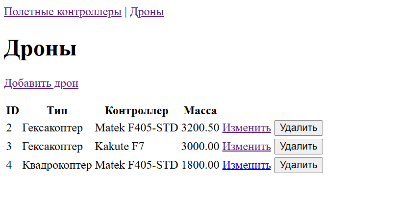
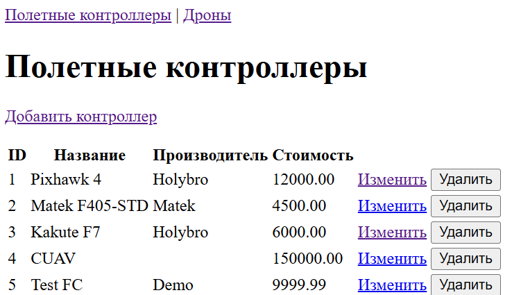
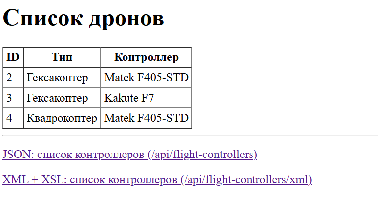
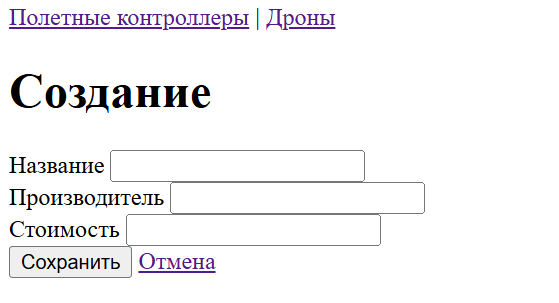

# Лабораторная работа №2
Выполнил: Абельдинов Рафаэль  
Группа: 6132-010402D  

## Задание 1  
В качестве базы данных была взята база данных из предыдущей работы.

## Задание 2
Реализованы две сущности: Drone и FlightController, а также репозитории для обоих сущностей.  
Конфигурация для подключения к базе данных была задана в файле `application.properties`.

## Задание 3
Для реализации сервисов были созданы интерфейсы DroneSErvice и FlightControllerService и их реализация.

## Задание 4
Были созданы контроллеры для обработки запросов.
В HTML-страницах использовался Thymeleaf.

## Задание 5
После запуска приложения страницы открываются в браузере.
Интерфейс табличы дронов:

И полетных контроллеров:

Интерфейс добавления нового дрона выглядит следующим образом:

Аналогичный интерфейс на страничке создания полетного контроллера:
